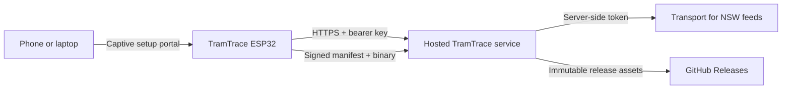

# TramTrace

[](https://github.com/ProccyBoi/TramTrace/actions/workflows/ci.yml)
[](https://github.com/ProccyBoi/TramTrace/releases/latest)
[](https://tramtrace-sydney-live.chatgptbolt.chatgpt.site/healthz)

TramTrace turns a custom ESP32/WS2812 PCB into a live, direction-aware map of
Sydney's L1, L2, L3 and L4 light-rail services. This repository contains the
production firmware, the hosted edge service, a self-hostable FastAPI backend,
the traced PCB-to-station map, release tooling and automated tests.

The project takes its captive-portal and live-map product direction from
[Metroboard](https://github.com/ProccyBoi/Metroboard), while using a separate
payload and hardware map built specifically for TramTrace.

## What is included

- A first-boot Wi-Fi portal with nearby-network discovery and hidden-SSID
  support.
- Persistent Wi-Fi, API, brightness and board-access-key configuration in ESP32
  NVS.
- A direction-aware, 68-station payload with independent source freshness and
  last-good caching.
- A permanently hosted Sites Worker and a self-hostable FastAPI service.
- Authenticated HTTPS for live data and OTA downloads using the ESP32 Mozilla
  CA bundle.
- Signed ECDSA P-256 OTA releases, SHA-256 binary verification and delayed
  rollback confirmation.
- Native firmware-policy tests, backend tests, hosted-service tests, dependency
  auditing and reproducible CI builds.



The production status page is
[tramtrace-sydney-live.chatgptbolt.chatgpt.site](https://tramtrace-sydney-live.chatgptbolt.chatgpt.site/).

## Hardware profile and safety

The production target is an ESP32-WROOM-32E with 16 MB flash and a CH340 USB
serial interface. Route strips use GRB WS2812 data at 800 kbit/s.

| Purpose | GPIO | Pixels |
| --- | ---: | ---: |
| L1 | 16 | 45 |
| L2 branch | 17 | 8 |
| L3 and shared L2/L3 trunk | 18 | 30 |
| L4 | 19 | 32 |
| Status | 25 | 1 |

There are 116 addressable LEDs in total. Do not run an all-white,
full-brightness test from a normal computer USB port. Firmware limits route
brightness to 64/255, and its first-boot hardware test lights only one route
pixel at a time. See [hardware/README.md](hardware/README.md) before changing
any GPIO or pixel mapping.

## Direction convention

Each station payload is `[slot 0, slot 1]`:

| Route | Slot 0 heads toward | Slot 1 heads toward |
| --- | --- | --- |
| L1 | Dulwich Hill | Central |
| L2 | Randwick | Circular Quay |
| L3 | Juniors Kingsford | Circular Quay |
| L4 | Westmead | Carlingford |

The schematic and PCB prove station pairing and chain order, but contain no
destination arrows. These destination labels are therefore the software/GTFS
convention until visually confirmed on an assembled front board. The
`test-pairs` serial command performs that acceptance test one station at a
time. L1 Central has one physical route pixel, so its two states are merged.

## Quick start

### Prerequisites

- Python 3.10 or newer
- [PlatformIO Core](https://docs.platformio.org/en/latest/core/installation/index.html)
- A data-capable USB cable and the CH340 driver for the board

Clone and verify the project:

```powershell
git clone https://github.com/ProccyBoi/TramTrace.git
cd TramTrace
python -m pip install -r server/requirements.txt platformio==6.1.19
python -m pytest tests -q
platformio test -e native
platformio run -e tramtrace
```

Discover attached ports, then flash one or more boards. Replace the example
port names with the values reported on your computer:

```powershell
platformio device list
powershell -NoProfile -ExecutionPolicy Bypass -File `
  .\scripts\flash_connected_boards.ps1 -Ports COM9,COM20
```

The multi-board uploader validates that each selected port is a CH340 device,
writes the bootloader, partition table, OTA metadata and application, and
preserves the NVS configuration partition. For a firmware-only update to one
board, use:

```powershell
.\scripts\upload_firmware_only.ps1 -Port COM9
```

## First-boot setup

On its first TramTrace boot, the board runs a safe one-pixel chase and creates
an access point named `TramTrace-Setup-XXXXXX`.

1. Join that network from a phone or laptop.
2. Open `http://192.168.4.1/` if the captive portal does not appear.
3. Select a nearby Wi-Fi network or enter a hidden SSID.
4. Enter the API base URL. The production default is already compiled in.
5. Enter the operator-provided board access key when using the hosted service,
   choose brightness `1..64`, then save.

Saved Wi-Fi passwords and board keys are never printed to serial or populated
back into the portal. Leaving a secret field blank keeps the stored value when
the SSID is unchanged; the portal provides an explicit control to remove a
saved board key. A board key is sent as an `Authorization: Bearer` header and
is rejected with an unencrypted HTTP endpoint.

USB provisioning is also available:

```text
provision|ssid|password|https://backend.example|board-access-key|20
```

The serial console runs at 115200 baud. Available commands are `info`, `test`,
`test-pairs`, `simulate`, `simulate-loop`, `stop`, `map`, `config`,
`ota-check`, `provision|...` and `factory-reset`.

## Live display behavior

States are Metroboard-compatible: `0` is off, `1` is in range, `2` is
approaching and `3` is at the station. Every non-zero state is shown as a solid
route colour. If two routes share a physical pixel, the stronger state wins
and equal states resolve deterministically.

The service deduplicates source-scoped vehicle and trip identities before
emitting station states. A missing station is never guessed, stale data is
rejected, and the board clears an expired last-good frame after 60 seconds.
Default distance bands are 120 m, 450 m and 800 m; L4 also has a tightly
bounded Trip Update fallback for intermittent vehicle-position coverage.

## Secure OTA updates

Firmware checks `/firmware_manifest` 60 seconds after joining Wi-Fi and every
six hours thereafter. Failed checks retry after 15 minutes; `ota-check` starts
the same process immediately.

The update chain is fail-closed:

1. HTTPS validates the service hostname and certificate chain against the CA
   bundle compiled into ESP32 Arduino.
2. The firmware accepts only the expected TramTrace product, signing-key ID,
   semantic version and same-service immutable binary URL.
3. An ECDSA P-256 signature binds the version, byte size and SHA-256 digest.
4. SHA-256 is checked while the inactive OTA slot is written; the ESP32 updater
   also checks its MD5 transfer digest before committing the image.
5. A newly booted image remains pending until it survives the startup delay and
   verifies a signed manifest over HTTPS. If it restarts before that checkpoint,
   the ESP32 bootloader can return to the prior slot.

The private signing key exists only as the `OTA_SIGNING_KEY_B64` GitHub Actions
secret. Release assets are public and contain no Wi-Fi, TfNSW or board
credentials.

## Backends and deployment

The production Sites Worker is in [`hosting/`](hosting/README.md). Its protected
board route fetches all three TfNSW light-rail sources concurrently, applies
per-source freshness rules and emits the firmware schema. `/healthz` reports
deployment readiness separately from whether a particular edge isolate already
has fresh realtime data cached.

A self-hostable implementation is in [`server/`](server/README.md):

```powershell
$env:TFNSW_API_TOKEN = "your Transport for NSW Open Data token"
python -m uvicorn server.app:app --host 0.0.0.0 --port 8000
```

Transport credentials stay server-side. Never compile them into firmware or
commit them to the repository.

## Repository layout

| Path | Purpose |
| --- | --- |
| `src/main.cpp` | ESP32 firmware, setup portal, polling, simulation and OTA |
| `include/` | Station map, display rules, device identity and OTA policy |
| `hardware/` | Auditable PCB chain/station cross-reference |
| `server/` | FastAPI implementation and configuration reference |
| `hosting/` | Production Sites Worker, status page and hosted tests |
| `scripts/` | Multi-board flashing, transit-index generation and release signing |
| `test/`, `tests/` | Native, backend, hardware and release tests |
| `.github/workflows/` | CI and signed firmware publication |

## Verification and release process

Run the full local gate before opening a pull request:

```powershell
python -m pytest tests -q
platformio test -e native
platformio run -e tramtrace
cd hosting
pnpm install --frozen-lockfile
pnpm audit --audit-level high
pnpm lint
pnpm test
```

CI repeats the backend, native firmware, ESP32 build, hosted dependency audit,
lint and hosted tests. A firmware release must come from `main`: update
`kFirmwareVersion` to `X.Y.Z`, merge a green pull request, then push the matching
`vX.Y.Z` tag. The release workflow re-runs release/native tests, rebuilds the
firmware, signs the manifest and publishes immutable assets to GitHub Releases.

## Security, contributions and license

Report vulnerabilities privately as described in [SECURITY.md](SECURITY.md).
Contribution requirements are in [CONTRIBUTING.md](CONTRIBUTING.md).

This repository is publicly visible but does not yet grant an open-source
license. Standard copyright restrictions therefore apply until the maintainer
adds a `LICENSE` file. Selecting a licence is a legal/product decision and is
the remaining prerequisite for third-party redistribution.
